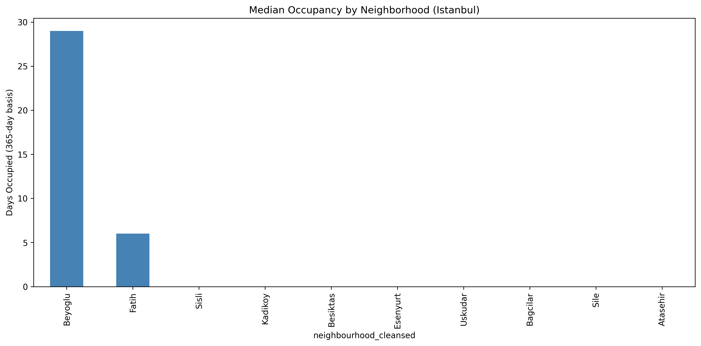
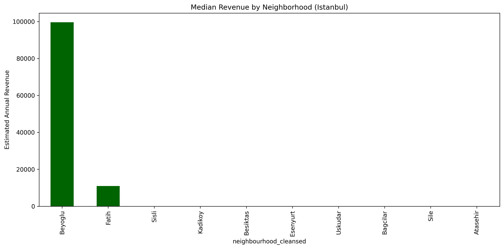
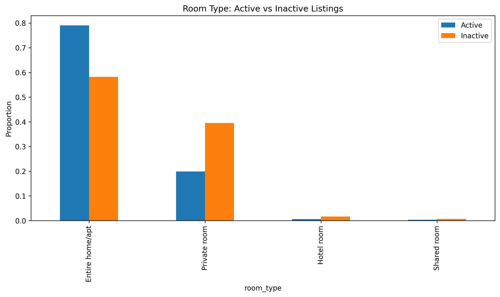
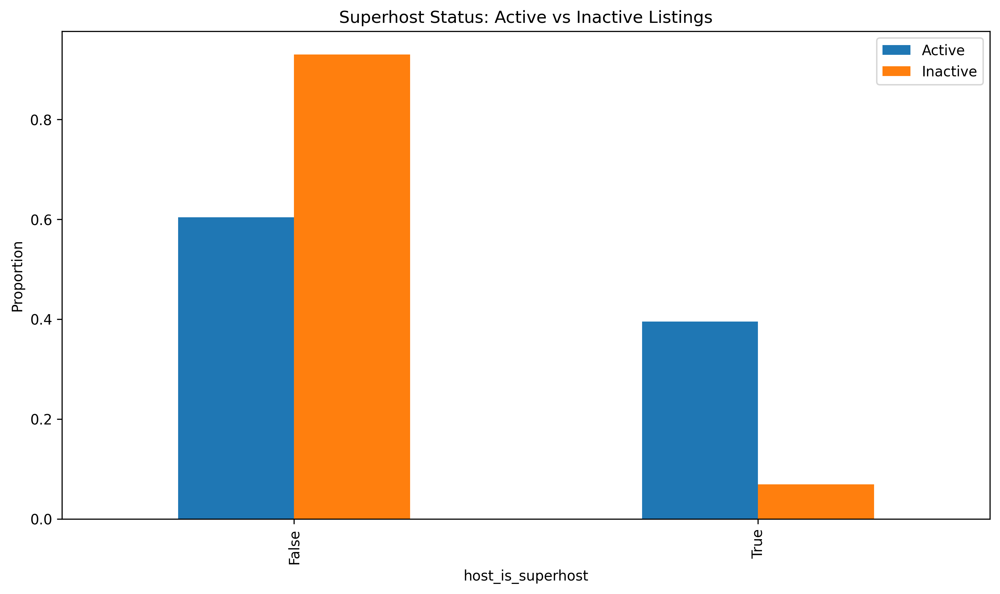
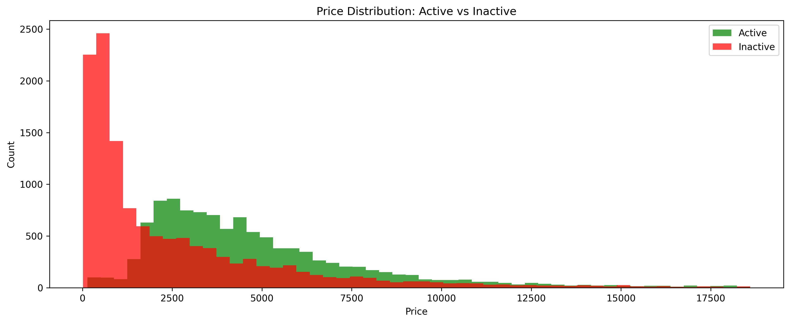

# Istanbul Airbnb Market Analysis (2026)


## Project Overview
This project analyzes Istanbul Airbnb listings to identify what drives listing success using real market data from Inside Airbnb.

The core business question is:
**Why are many listings inactive, and which factors are associated with higher occupancy and revenue?**

---

## Data Source
- **Source:** Inside Airbnb (Istanbul, Marmara, Turkey)
- **Snapshot:** 30 June 2026
- **Main file used for analysis:** `listings.csv.gz`
- **Supporting files:** `calendar.csv.gz`, `reviews.csv.gz`, `neighbourhoods.csv`, `neighbourhoods.geojson`

---

## Repository Structure
```text
Istanbul-Airbnb-Analysis/
├── data/
│   └── raw/
│       ├── listings.csv.gz
│       ├── calendar.csv.gz
│       ├── reviews.csv.gz
│       ├── reviews.csv
│       ├── neighbourhoods.csv
│       └── neighbourhoods.geojson
├── visuals/
│   ├── istanbul-cover.jpg
│   ├── occupancy_by_neighborhood.png
│   ├── revenue_by_neighborhood.png
│   ├── room_type_comparison.png
│   ├── superhost_comparison.png
│   └── price_distribution.png
├── Istanbul-Airbnb-Analysis.ipynb
├── README.md
├── requirements.txt
└── .gitignore
```

---

## Analysis Workflow
1. Data loading and audit
2. Missing value and type checks
3. Price cleaning and outlier treatment
4. Active vs inactive market segmentation
5. Neighborhood performance comparison
6. Room type and superhost impact analysis
7. Visualization and final business insights

---

## Data Review (What the data revealed)
- Initial listings: **26,631**
- Cleaned analytical sample: **23,467**
- Key quality issues found:
  - Missing values in `beds`, `bathrooms`, `review_scores_rating`
  - Extreme price outliers that distort averages
- Key segmentation:
  - **Active listings:** occupancy > 0
  - **Inactive listings:** occupancy = 0

---

## Key Findings
1. **Market concentration:** Active demand is heavily concentrated in a few areas, especially Beyoglu.
2. **Room type effect:** Active listings are mostly entire homes/apartments.
3. **Host quality effect:** Superhost share is much higher in active listings than inactive listings.
4. **Price-performance split:** Active listings have a much higher median price than inactive listings.

---

## Visualizations
### Median Occupancy by Neighborhood


### Median Revenue by Neighborhood


### Room Type: Active vs Inactive


### Superhost: Active vs Inactive


### Price Distribution: Active vs Inactive


---

## Business Recommendations
- Prioritize neighborhoods with proven occupancy performance.
- Favor listing formats aligned with active demand (entire home/apt).
- Improve host trust signals (Superhost pathway, response quality).
- Use neighborhood-aware pricing instead of one generic pricing strategy.

---

## Run the Project
```bash
pip install -r requirements.txt
jupyter notebook
```

Open:
- `Istanbul-Airbnb-Analysis.ipynb`

---

## GitHub Pages (HTML Project Page)
To publish a live project page:
1. Export the notebook to HTML.
2. Save it as `index.html` in the repository root.
3. Enable GitHub Pages from the `main` branch (root) in repository settings.

Live URL format:
`https://siavashrko.github.io/Istanbul-Airbnb-Analysis/`
